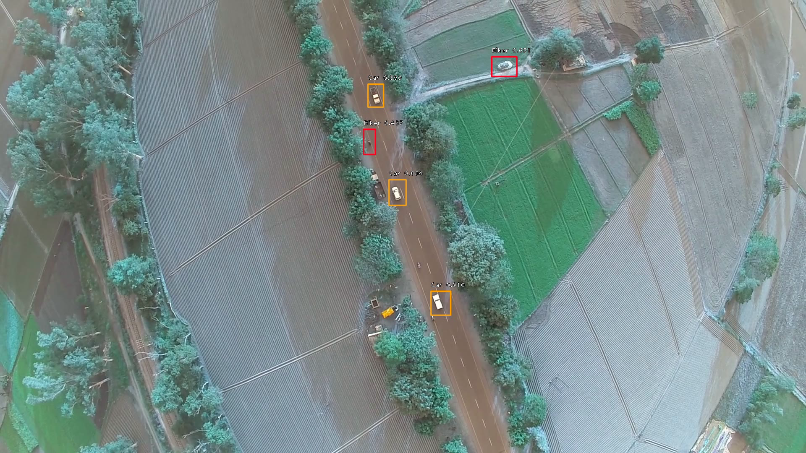
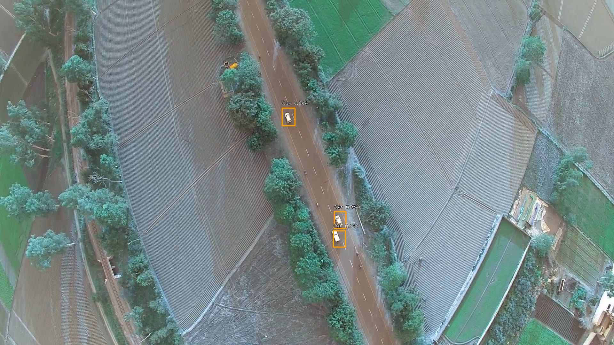
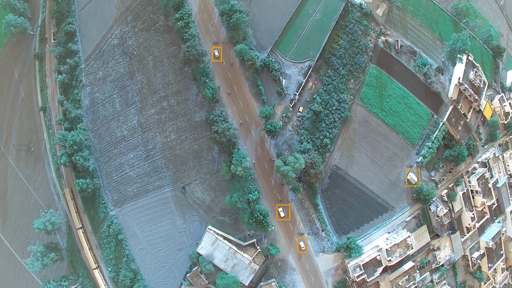

# Retinanet-UAV-detection
Detection of objects by UAV's 

Detecting objects from UAV camera using Retinanet object detection algorithm.

Detecting vehicles

detecting vehicles

detecting vehicles with good accuracy from altitude of around 1000 feet
